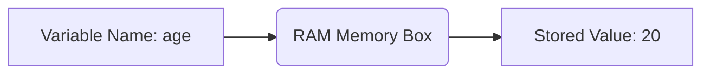

# 🚀 Chapter 01: Python Setup, Syntax & Variables

Welcome to the first module of Python Mastery. In this section, we will learn how Python handles memory and basic syntax.

---

## 1. Visualizing Variables in Memory 🧠
Think of a variable as a named **Storage Box** 📦 inside your computer's RAM. 



---

## 2. Python Syntax vs Other Languages 🐍
Python is famous for its clean syntax. It does not use semicolons `;` or curly braces `{}`. Instead, it uses **Indentation (Spaces)** to structure code.

### 💻 Code Example: Dynamic Typing
In Python, you don't need to declare data types explicitly. Python understands it automatically!

```python
# Open your VS Code editor and try this:

age = 20          # Automatically detected as Integer (int)
price = 99.99     # Automatically detected as Float (float)
name = "Student"  # Automatically detected as String (str)
is_coding = True  # Automatically detected as Boolean (bool)

# Printing values with modern f-strings
print(f"Name is {name} and age is {age}")
```

---

## ⚠️ Common Pitfall: Type Casting
By default, the `input()` function in Python always takes data as a **String**. If you want to perform math operations, you must cast (convert) it!

```python
# ❌ INCORRECT WAY (Will cause error or wrong output)
# age = input("Enter your age: ")
# print(age + 5) 

#  CORRECT WAY (Explicit Type Casting)
user_age = int(input("Enter your age: "))
print(f"In 5 years, you will be: {user_age + 5}")
```

---

## 🎯 Quick Class Challenge
Look at the code snippet below. Can you guess what will happen if you run this?
```python
x = "10"
y = 5
print(x * y)
```
*(Tip: In Python, multiplying a string with an integer behaves differently!)*
