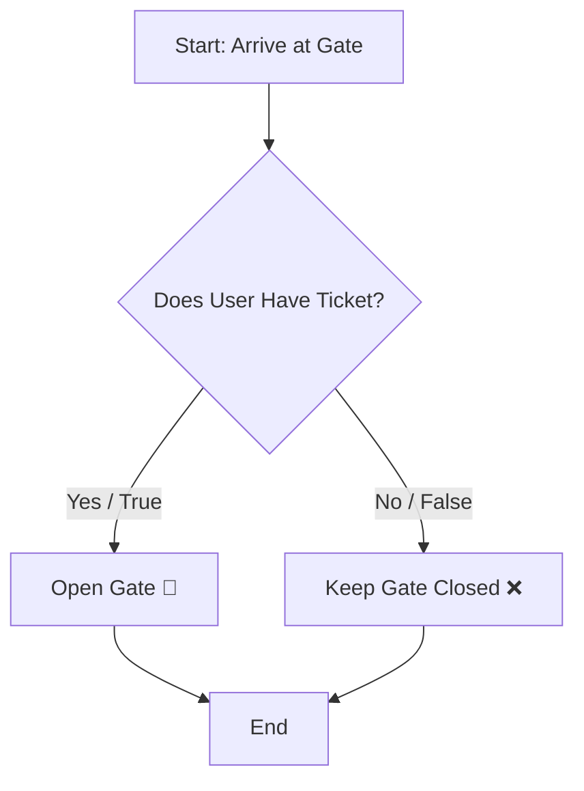

# 🚦 Chapter 02: Operators & Control Flow

Welcome to Chapter 02! In this module, we will learn how Python makes logical decisions. Without control flow, programs can only run line-by-line. With control flow, your code gains a "brain" to choose paths.

---

## 1. Visual Logic: How Decisions Work 🧠
Think of control flow like an automated gate at a parking lot. **IF** you have a valid ticket, the gate opens. **ELSE**, it stays closed.



---

## 2. Types of Operators in Python 🛠️
Before making decisions, we need to compare data. Python uses these core operators:

### A. Comparison Operators (Result is always `True` or `False`)
*   `==` : Equal to (e.g., `5 == 5` is `True`)
*   `!=` : Not equal to (e.g., `5 != 3` is `True`)
*   `>` / `<` : Greater than / Less than
*   `>=` / `<=` : Greater than or equal to / Less than or equal to

### B. Logical Operators (Combining Multiple Conditions)
*   `and` : Returns `True` only if **ALL** conditions are true.
*   `or`  : Returns `True` if **AT LEAST ONE** condition is true.
*   `not` : Reverses the result (turns `True` to `False` and vice versa).

---

## 3. Structural Syntax: `if-elif-else` 💻
Python uses **Indentation (4 spaces)** to define blocks of code instead of curly braces `{}`. 

### Production-Ready Example: Grading System
Open your code editor and try this example to see how multi-condition evaluation works:

```python
# System checks score and gives proper badge
score = int(input("Enter student score (0-100): "))

if score >= 90:
    print("Result: Grade A+ 🌟 (Excellent Work!)")
elif score >= 75:
    print("Result: Grade B 👍 (Good Job!)")
elif score >= 33:
    print("Result: Grade C 😮‍💨 (Passed!)")
else:
    print("Result: Grade F ❌ (Failed. Need Improvement!)")
```

---

## ⚠️ Common Pitfalls to Avoid (For Beginners)

1. **The Assignment Bug (`=` vs `==`)**
   * `x = 10` means you are *storing* 10 inside x.
   * `x == 10` means you are *asking* "Is x equal to 10?". Never use a single `=` inside an `if` statement!

2. **IndentationError**
   All code inside the same condition block must have the exact same number of leading spaces.
   ```python
   # ❌ WRONG
   if True:
   print("Hello") # Missing spaces!
   
   #   CORRECT
   if True:
       print("Hello") # 4 spaces indent
   ```

---

## 🎯 Practical Lab Challenges

### Challenge 1: Even or Odd Checker
Write a program that takes an integer input from the user and checks if the number is **Even** or **Odd**.
*(Tip: Use the Modulus `%` operator. If `num % 2 == 0`, it is Even!)*

### Challenge 2: Leap Year Finder
Write a program to check if a year entered by the user is a leap year or not.

---
