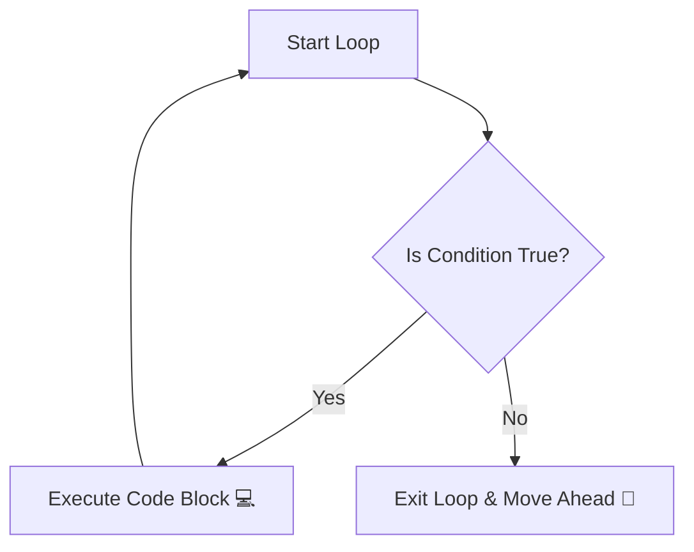
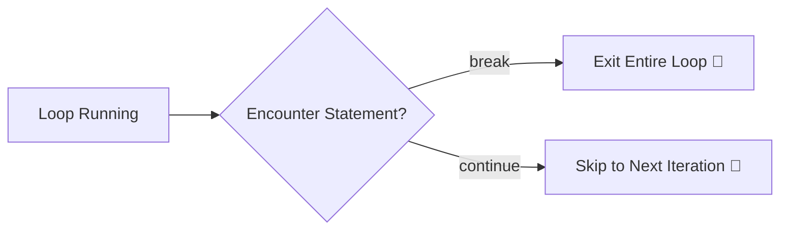

# 🔄 Chapter 03: Loops & Iterations

Welcome to Chapter 03! In this module, we will learn how to make Python repeat tasks automatically. Writing the same line of code multiple times is bad practice. Loops allow us to run a block of code hundreds or thousands of times efficiently.

---

## 1. Visual Logic: How Loops Work 🧠
Think of a loop like running laps around a football ground 🏃‍♂️. You check a condition: *"Have I completed 5 laps?"*. If No, you run another lap. If Yes, you stop.



---

## 2. Types of Loops in Python 🛠️

### A. The `for` Loop (Sequence-Based Iterator)
Used when you know in advance how many times you want to run the code (e.g., iterating through a list, string, or a specific range).

*   **The `range(start, stop, step)` function**: Generates numbers dynamically.
```python
# Iterating numbers from 1 to 5
for i in range(1, 6):
    print(f"Iteration Number: {i}")
```

### B. The `while` Loop (Condition-Based Iterator)
Used when you do not know the exact number of iterations beforehand, and execution depends strictly on a condition remaining `True`.

```python
# A simple loading countdown setup
countdown = 3
while countdown > 0:
    print(f"Loading in... {countdown}")
    countdown -= 1  # Infinite loop checking: Crucial step!
print("Go! 🚀")
```

---

## 3. Loop Control Statements 🚦
Sometimes, you need to alter the natural flow of a loop dynamically:
*   `break`: Exits the loop immediately, ignoring all remaining lines.
*   `continue`: Skips the rest of the current iteration and jumps directly to the next loop check.
*   `pass`: A structural placeholder when syntactically a code block is required but no action is needed yet.



---

## ⚡ Modern Python Concept: List Comprehension
Instead of writing 3-4 lines of code to generate a new list using traditional loops, modern developers compress it into a clean single line.

```python
# Traditional Way ❌
squares = []
for x in range(1, 6):
    squares.append(x * x)

# Modern List Comprehension Way  (High-Speed Execution)
squares = [x * x for x in range(1, 6)]
print(squares) # Output: [1, 4, 9, 16, 25]
```

---

## 🎯 Practical Lab Challenges

### Challenge 1: The Multiplication Table
Write a program that takes a number input from the user and prints its complete multiplication table from 1 to 10 using a `for` loop.

### Challenge 2: The Secure ATM Pin Lockout
Simulate an ATM pin screen using a `while` loop. Give the user exactly 3 attempts to type the correct PIN (`1234`). If they fail 3 times, print *"Card Blocked! 🔒"*. If they succeed, break the loop and print *"Access Granted! 🔓"*.

---
