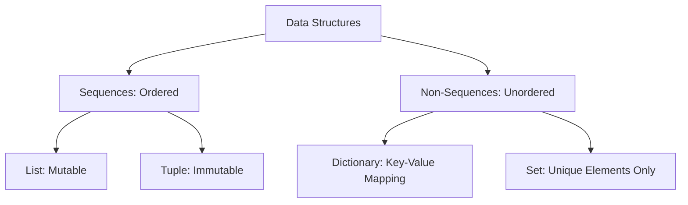

# 📦 Chapter 04: Inbuilt Data Structures

Welcome to Chapter 04! Until now, we stored only one value inside a variable (like `age = 20`). But in real-world programming, we handle collections of data (like a list of 100 students or product details). 

Python provides 4 powerful built-in data structures to group and manage data efficiently.

---

## 1. Quick Cheat Sheet: The Big Four 📊

Understanding when to use which data structure is the mark of a good software developer:

| Data Structure | Ordered? | Mutable (Changeable)? | Duplicates Allowed? | Syntax |
| :--- | :--- | :--- | :--- | :--- |
| **List** | Yes 🟢 | Yes 🟢 (Can append/remove) | Yes 🟢 | `my_list = [1, 2, 2]` |
| **Tuple** | Yes 🟢 | No 🔴 (Locked / Read-Only) | Yes 🟢 | `my_tuple = (1, 2, 2)` |
| **Dictionary** | Yes 🟢 | Yes 🟢 (Key-Value pairs) | No 🔴 (Keys must be unique) | `my_dict = {'id': 1}` |
| **Set** | No 🔴 | Yes 🟢 (But no indexing) | No 🔴 (Removes duplicates) | `my_set = {1, 2, 3}` |

---

## 2. Core Concepts & Practical Use Cases 🛠️

### A. Lists (The Flexible Collection)
Used for item listings where order matters and data can change frequently (e.g., Shopping carts, Todo tasks).
*   **Key Methods**: `append()`, `insert()`, `pop()`, `remove()`, `sort()`.
```python
fruits = ["apple", "banana"]
fruits.append("orange") # Adding a new item
print(fruits[0])        # Indexing: Output is "apple"
```

### B. Tuples (The Locked Collection)
Used for data that must never change during runtime for safety (e.g., GPS Coordinates, Database credentials, Server configuration ports).
```python
coordinates = (26.218, 78.182) # Latitude & Longitude of Gwalior [2026]
# coordinates[0] = 12.34       # ❌ Error: Tuples cannot be modified!
```

### C. Dictionaries (The Key-Value Storage)
Used to map structured details onto a single entity (e.g., Student profile, Product specifications, JSON configurations).
```python
student = {
    "name": "Amit Sharma",
    "roll_no": 101,
    "skills": ["Python", "SQL"]
}
print(student["name"]) # Fetching data using Key
```

### D. Sets (The Unique Collection)
Used to eliminate duplicate entries instantly or perform mathematical evaluations (e.g., Tracking unique visitor IP addresses, finding common users).
```python
raw_ids = [1, 2, 2, 3, 4, 4]
unique_ids = set(raw_ids) 
print(unique_ids) # Output: {1, 2, 3, 4} (Duplicates removed automatically!)
```

---

## 3. Structural Visualization: Memory Model 🧠



---

## 🎯 Practical Lab Challenges

### Challenge 1: The Inventory Manager
Create a Python List containing 3 item names. Take a new item input from the user and append it. Then, sort the complete inventory alphabetically and print it.

### Challenge 2: Employee Lookup System
Create a Dictionary with 3 employee IDs as keys and their names as values. Take an ID input from the user and print the corresponding employee name. If the ID is not found, print a safe message: *"Employee ID not found!"*.

---
