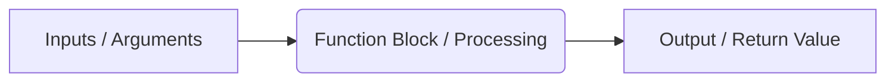

# ⚙️ Chapter 05: Functional Programming

Welcome to Chapter 05! In this module, we will learn how to write clean, reusable blocks of code called **Functions**. Writing code without functions means duplicating logic, which makes software bulky and hard to maintain. Functions help us follow the **DRY (Don't Repeat Yourself)** principle.

---

## 1. Visual Logic: How Functions Work 🧠
Think of a function like a **Juicer Machine** 🥤. You give it inputs (Fruits), it processes them inside (Blends), and gives you an output (Juice).



---

## 2. Advanced Arguments (`*args` and `**kwargs`) 🛠️

Standard functions need a fixed number of inputs. But what if you don't know how many inputs the user will send? Modern Python handles this seamlessly:

### A. Arbitrary Arguments (`*args`)
Allows a function to accept any number of positional arguments. Inside the function, they are received as a **Tuple**.
```python
def add_all(*args):
    # args behaves like a tuple
    return sum(args)

print(add_all(5, 10, 15)) # Output: 30
```

### B. Keyword Arbitrary Arguments (`**kwargs`)
Allows a function to accept any number of keyword arguments (named parameters). Inside the function, they are received as a **Dictionary**.
```python
def save_user_profile(**kwargs):
    # kwargs behaves like a dictionary
    for key, value in kwargs.items():
        print(f"{key}: {value}")

save_user_profile(username="rahul99", city="Delhi", role="Admin")
```

---

## ⚡ Modern Concept: Anonymous Lambda Functions
Lambda functions are small, single-line functions that do not use the standard `def` keyword. They are perfect for quick operations, filtering, or sorting datasets.

```python
# Traditional Way ❌
def square(x):
    return x * x

# Modern Lambda Way 
square_lambda = lambda x: x * x

print(square_lambda(4)) # Output: 16
```

---

## 🎯 Practical Lab Challenges

### Challenge 1: The Flexible Total Bill Calculator
Write a function called `calculate_total(*prices)` that takes any number of item prices, calculates their sum, adds a 5% tax to the final total, and returns the amount.

### Challenge 2: The Smart Filter Engine
Use a lambda function alongside Python's built-in `filter()` to extract all numbers greater than 50 from a raw dataset.

---
