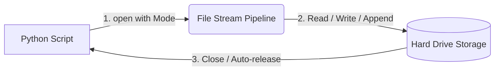

# 💾 Chapter 06: File Handling

Welcome to Chapter 06! Until now, whenever we ran our code, the data was stored in RAM. As soon as the program closed, our data vanished. In this chapter, we will learn how to read and write data permanently to the hard drive using Text, CSV, and JSON formats.

---

## 1. Visual Logic: File Streams 🧠
Think of file handling as a **pipeline** 🚰 between your Python Script and your Hard Drive. You must explicitely OPEN the stream, do your work, and CLOSE the stream to avoid system resource leaks.



---

## 2. File Modes & Formats 🛠Consts

### A. The Safe Way: `with open()` Block
Always use the `with` keyword. It automatically closes the file even if your program crashes midway.
*   `r`: Read mode (Default)
*   `w`: Write mode (Overwrites existing data)
*   `a`: Append mode (Adds data at the end without erasing)

### B. Standard Formats Used in Industry
1.  **Plain Text (`.txt`)**: For logs or rough data dumps.
2.  **CSV (`.csv`)**: Comma-Separated Values. Used as spreadsheets for **Data Science**.
3.  **JSON (`.json`)**: JavaScript Object Notation. Structured data used everywhere for **Web Development & APIs**.

---

## 💻 Production-Ready Code Implementations

### Reading and Writing Structured JSON Data
JSON is identical to Python Dictionaries. We use the inbuilt `json` module to encode and decode it:

```python
import json

# Python Dictionary
user_data = {
    "institute": "Python Academy",
    "active_students": 45,
    "courses": ["Core Python", "Data Science"]
}

# 1. Writing (Saving) to a file - dump
with open("config.json", "w") as file:
    json.dump(user_data, file, indent=4)
    print("Data saved to config.json successfully! 🎉")

# 2. Reading (Loading) from a file - load
with open("config.json", "r") as file:
    loaded_data = json.load(file)
    print(f"Loaded Institute Name: {loaded_data['institute']}")
```

---

## ⚠️ Common Pitfall: The Write Overwrite Danger
Using the `"w"` mode on a file that already has records will **completely wipe out its previous content**. Always use `"a"` (append mode) if you want to update logs or list files sequentially without erasing history.

---

## 🎯 Practical Lab Challenges

### Challenge 1: The Automated Logger
Write a program that takes notes or remarks from the user using `input()` and appends it dynamically into a file called `history.txt` on a new line.

### Challenge 2: CSV Data Extraction
Create a custom comma-separated table layout containing three students' details (RollNo, Name, Grade). Save it as `scores.csv` and write a script to display each student's name line by line.

---
