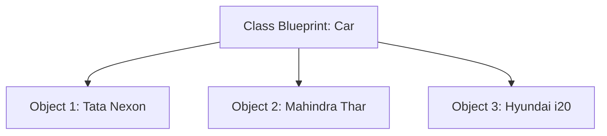

# 🧱 Chapter 07: Object-Oriented Programming (OOPs)

Welcome to Chapter 07! Until now, our code was structural and split across open variables and raw functions. As your software grows, you need an organized way to bundle data and functions together. OOPs solves this by allowing us to mimic real-world objects inside computer memory.

---

## 1. Visual Concept: Class vs Object 🧠
Think of a **Class** as a master blueprint 📐 drawn on paper. Think of an **Object** as the actual concrete physical house 🏠 built using that blueprint. You can build 100 houses using a single blueprint!



---

## 2. The 4 Pillars of OOPs 🏛️

### A. Encapsulation (Data Hiding 🔒)
Restricting direct access to an object's internal variables to prevent accidental modifications. We use a double underscore `__` prefix to make attributes **Private**.
```python
class BankAccount:
    def __init__(self):
        self.__balance = 5000  # Private attribute

    def get_balance(self):    # Safe Getter method
        return self.__balance
```

### B. Inheritance (Code Reusability 👥)
Allowing a new class (Child) to adopt all attributes and methods of an existing class (Parent) without duplicating code.
```python
class Vehicle: # Parent
    def start_engine(self):
        print("Engine started... Vroom!")

class ElectricCar(Vehicle): # Child inherits Vehicle
    pass

tesla = ElectricCar()
tesla.start_engine() # Works perfectly!
```

### C. Polymorphism (Many Forms 🎭)
The ability of different classes to execute the same method name in different ways (**Method Overriding**).
```python
class Dog:
    def speak(self): return "Woof!"

class Cat:
    def speak(self): return "Meow!"
```

### D. Abstraction (Hiding Complexity 🎛️)
Hiding complex internal code and showing only essentials to the user (e.g., Pressing an accelerator pedal without knowing how the internal combustion engine works).

---

## 💻 Production-Ready Code Implementation: The Smart Employee System

```python
class Employee:
    def __init__(self, name, emp_id, salary):
        self.name = name
        self.emp_id = emp_id
        self.__salary = salary  # Encapsulated (Private) variable

    # Getter method to read private salary safely
    def display_profile(self):
        print(f"ID: {self.emp_id} | Name: {self.name} | Salary: Hidden")

# Child class inheriting from Employee
class Manager(Employee):
    def __init__(self, name, emp_id, salary, department):
        # super() connects child constructor to parent constructor
        super().__init__(name, emp_id, salary)
        self.department = department

    # Polymorphism: Overriding the display method
    def display_profile(self):
        print(f"Manager: {self.name} | Directs Dept: {self.department}")

# Executing code
mgr = Manager("Rahul Verma", "MGR102", 95000, "IT Infrastructure")
mgr.display_profile() # Output: Manager: Rahul Verma | Directs Dept: IT Infrastructure
```

---

## ⚠️ Common Pitfall: Forgetting `self`
Inside a class definition, every single function (method) **must** accept `self` as its first parameter. `self` represents the specific object instance currently executing the code. Forgetting `self` will throw a `TypeError`.

---

## 🎯 Practical Lab Challenges

### Challenge 1: Smartphone Blueprint
Create a class called `Smartphone` with attributes: `brand`, `model`, and `price`. Add a method called `get_description()` that returns a formatted profile string. Create two unique objects from this class.

### Challenge 2: The E-commerce Discount System
Create a Parent class `Product` with attributes `name` and `price`. Create a Child class `DigitalProduct` that overrides a method called `calculate_final_price()` by applying a 10% instant discount to the parent price.

---
