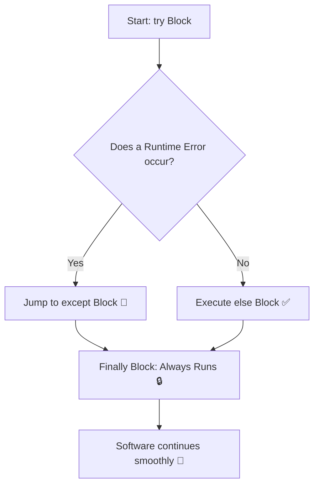

# ⚠️ Chapter 08: Exception Handling

Welcome to Chapter 08! No matter how good of a developer you are, runtime errors will happen (e.g., Internet disconnects mid-download, a user enters text instead of a number, or a file is missing). 

If you do not handle these errors, your software will crash immediately. Exception Handling allows your application to handle errors gracefully without stopping the user experience.

---

## 1. Visual Logic: The Safety Net Architecture 🧠
Think of Exception Handling like a **Trapeze Circus Performer** 🎪. The performance code runs on top. If anything breaks or they slip, the Safety Net (`except` block) catches them so they do not crash onto the floor.



---

## 2. Core Blocks Explained 🛠️

Modern runtime security blocks are written sequentially in Python using 4 key components:
*   `try`: Wrap the code here that might potentially throw an error.
*   `except`: This block executes **only if** an error occurs inside the try block. You can target specific errors like `ZeroDivisionError` or `ValueError`.
*   `else`: Executes **only if** the try block ran perfectly with zero errors.
*   `finally`: Executes **no matter what**. Whether an error came or not, this block will always run. Perfect for closing files or disconnecting cloud databases safely.

---

## 💻 Production-Ready Code Implementation: The Secure System Calculator

```python
def divide_server_loads():
    try:
        # User input could be faulty text or zero
        total_load = int(input("Enter total cluster load network hits: "))
        servers = int(input("Enter available server containers: "))
        
        result = total_load / servers

    except ValueError:
        print("Safety Action ⚠️: Invalid input type! Please enter integers only.")
    except ZeroDivisionError:
        print("Safety Action ⚠️: Infrastructure Alert! Containers cannot be zero.")
    except Exception as e:
        print(f"Safety Action ⚠️: Unexpected System Error: {e}")

    else:
        print(f"Execution Success ✅: Load per server container is: {result}")

    finally:
        print("Resource Cleanup 🔒: Closed active network channels and pipelines.")

# Run the cluster manager
divide_server_loads()
```

---

## ⚠️ Common Pitfall: The Silent Exception Catcher
Using a bare `except:` or `except Exception:` right at the top of your error handling without catching specific exceptions first is highly discouraged in the industry. It hides actual structural logical bugs in your code, making debugging an absolute nightmare. Always catch specific errors first!

---

## 🎯 Practical Lab Challenges

### Challenge 1: The Safe Integer Input Guard
Write a continuous while loop function that forces the user to enter a valid numeric age. If they enter text, catch the `ValueError` and print *"Invalid Input! Try again."*. The loop must only break when they provide a clean integer.

### Challenge 2: The Custom Age Exception Validator
Use the `raise` keyword to throw an error manually. Create a voting verification tool. If the incoming user profile age is less than 18, `raise ValueError("Underage registration denied! ⛔")`. Catch it smoothly down the pipeline.

---
