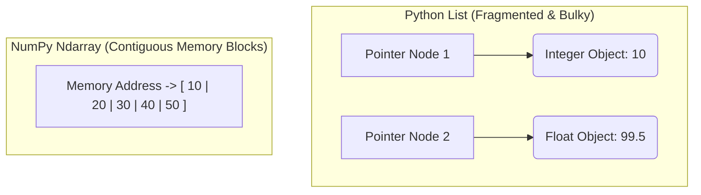

# 🔢 Module 01: NumPy - Advanced Vector Computations & Architecture

## 1. Introduction to NumPy 🐍
**NumPy**, which stands for **Numerical Python**, is the foundational skeletal framework for the entire Data Science, Machine Learning, and Artificial Intelligence ecosystem in Python. 

In standard Python, we use Lists to store data collections. However, when handling real-world datasets containing millions of rows, standard Python lists become extremely slow and consume massive amounts of computer memory. NumPy solves this problem by introducing a powerful new data object called the **`ndarray` (N-dimensional array)**. 

### Why is NumPy 50x Faster than Python Lists?
1. **Contiguous Memory**: Python Lists store data by creating pointers to scattered locations in RAM. NumPy stores data in one single continuous physical block in your hardware memory.
2. **Homogeneous Data**: Python Lists can hold different data types (text, numbers, booleans) which forces the CPU to check the type of every element. NumPy arrays only allow elements of the exact same data type, optimizing CPU cache usage.
3. **Vectorization**: NumPy passes mathematical operations directly to the internal processor hardware, executing them across all indexes simultaneously without using slow `for` or `while` loops.



---

## 2. Core Industrial Features 🛠️
* **Multi-Dimensional Grid Structures**: Easily create and handle 1D vectors, 2D matrices, or 3D/4D tensors for image processing and deep learning neural networks.
* **Vectorized Mathematical Operations**: Perform element-wise matrix math (addition, multiplication, logarithmic transformations) natively across massive tensors instantly.
* **Smart Broadcasting Engine**: Replicates smaller array shapes across larger matrix dimensions without copying data in memory to make shapes compatible for calculations.
* **Advanced Sieve Masking**: Filter through thousands of records dynamically inside memory without executing conditional `if-else` loops.

---

## 3. Installation & Quick Environment Verification 💻
To install the official production version of NumPy inside your system environment, execute the following command in your terminal:

```bash
pip install numpy
```

### Basic Verification Code Script:
```python
import numpy as np

# Verify version check
print(f"NumPy Version Loaded Successfully: {np.__version__}")

# Instant 1D vector instantiation
data_vector = np.array([10, 20, 30, 40])
print(f"Data Vector: {data_vector}")
print(f"Data Object Type: {type(data_vector)}")
```

---

## 🗺️ Deep-Dive Learning Sub-Modules

Click on any specialized documentation sheet below to master specific computational sub-layers:

1. ### 📐 [01: Advanced 2D Matrix Slicing & Boolean Filtering](./01-Advanced-Slicing.md)
   * Inspection properties (`.shape`, `.ndim`, `.dtype`).
   * 2D Coordinate mapping frameworks.
   * Sub-matrix extraction using layouts `[row, col]`.
   * Sieve Filtering using logical expressions (Boolean Indexing).

2. ### 🥞 [02: Vector Math, Broadcasting & Structural Stacking](./02-Advanced-Math-Stacking.md)
   * Axis-Wise reductions (`axis=0` vs `axis=1`).
   * The multi-dimensional Broadcasting rules.
   * Stacking matrices using `vstack` and `hstack` pipelines.
   * Universal mathematical operations (`np.where`, `np.unique`, `np.linspace`).

3. ### 🧪 [03: Interactive Practice Lab Workbook](./LAB_README.md)
   * Hands-on computational tasks for students.
   * Starter code structures ready to copy-paste.

---
