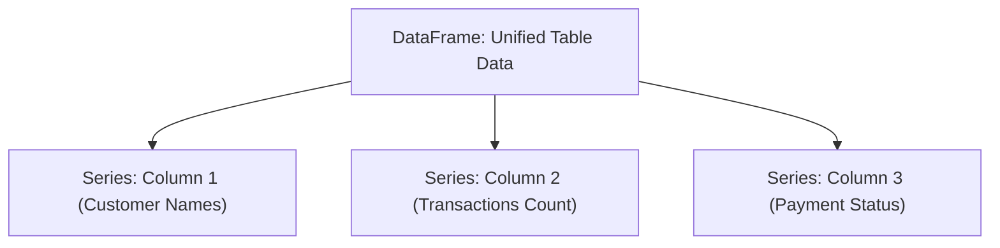

# 🐼 Module 02: Industrial Data Engineering & Wrangling (Pandas)

## 1. Introduction to Pandas 📊
While NumPy is excellent for processing uniform numerical matrix grids, real-world business data is much more complex. Business records arrive in the form of Excel sheets, CSV text dumps, or relational SQL database warehouses packed with missing fields, diverse column data types (dates, text, integers), and messy strings.

**Pandas** is the ultimate high-performance data engineering library built on top of NumPy. It allows software developers and analytics professionals to load, align, filter, aggregate, and reconstruct broken or dirty datasets with minimal lines of execution code.

### The Two Core Data Models:
1. **Series**: A 1-Dimensional labeled array capable of holding any data type (equivalent to a single column in an Excel spreadsheet).
2. **DataFrame**: A 2-Dimensional, size-mutable, tabular data structure with labeled axes (rows and columns). A DataFrame is essentially a collection of multiple Series objects stitched together.



---

## 2. Core Industrial Features 🛠️
* **Smart Data Alignment**: Automatic indexing profiles that prevent misalignment bugs during merge operations.
* **Integrated Ingestion Pipeline**: Inbuilt handlers to instantly parse standard files (`.csv`, `.xlsx`, `.json`, `.sql`).
* **Robust Label Slicing**: Sophisticated sub-setting using row/column headers instead of raw integer positions.
* **Flexible Aggregation**: High-speed database style indexing engines (`groupby`, `merge`, `join`).

---

## 3. Installation & Quick Environment Verification 💻
To install the official production distribution layout of Pandas, execute the following command in your terminal:

```bash
pip install pandas openpyxl
```
*(Note: `openpyxl` is required by Pandas backend to process modern Microsoft Excel files).*

### Basic Syntax Verification:
```python
import pandas as pd

# Verify library version
print(f"Pandas Framework Loaded: {pd.__version__}")

# Fast DataFrame instantiation from a raw python dictionary
user_map = {
    "Name": ["Amit", "Rahul", "Priya"],
    "Score": [88, 92, 79]
}
df = pd.DataFrame(user_map)
print("\n--- Verification DataFrame ---")
print(df)
```

---

## 🗺️ Deep-Dive Learning Sub-Modules

Click on any specialized documentation sheet below to master specific data handling sub-layers:

1. ### 🗄️ [01: Data Ingestion, Inspection & Structural Selection](./01-Data-Ingestion.md)
   * Loading datasets (`read_csv`, `read_excel`).
   * Structural structural discovery profiles (`.head()`, `.info()`, `.describe()`).
   * Selection operators configuration (`df.loc[]` vs `df.iloc[]`).

2. ### 🧼 [02: Advanced Cleaning Mechanics, Filters & Aggregations](./02-Advanced-Cleaning.md)
   * Handling missing elements (`.dropna()`, `.fillna()`).
   * Deduplication engines and data parsing strategies.
   * Multi-variable database style partitioning (`groupby`, value mutations).

3. ### 🧪 [03: Interactive Practice Lab Workbook](./LAB_README.md)
   * Real-world dirty dataset lab challenges for students.
   * Starter code structures ready to copy-paste.

---
