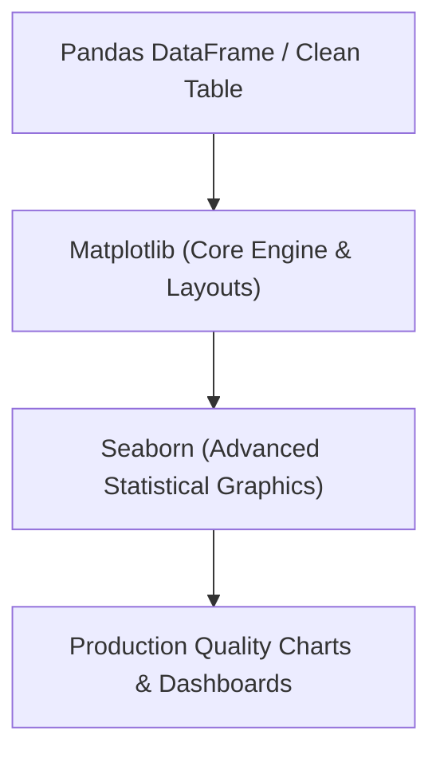

# 📉 Module 03: Graphical Data Journalism (Matplotlib & Seaborn)

## 1. Introduction to Data Visualization 🎨
Data cleaning and data engineering are hidden processes. To explain data-driven insights to business executives, stakeholders, or clients, a data scientist must use visual dashboards. Data Visualization is the art and science of translating billions of tabular cell figures into intuitive, graphical representations.

In the Python data ecosystem, visualization is powered by two main structural libraries:
1. **Matplotlib**: The low-level foundation engine. It provides total pixel-by-pixel control over figures, axes, ticks, labels, and plot markers.
2. **Seaborn**: The high-level statistical interface built on top of Matplotlib. It integrates natively with Pandas DataFrames to generate beautiful, automated statistical plots (like distributions and heatmaps) with minimal code layout.



---

## 2. Core Industrial Features 🛠️
* **Object-Oriented Plotting**: Explicit control over separate figure frames and internal axis coordinates independently.
* **Native DataFrame Mapping**: Direct data column parsing using Pandas keywords (`data=df, x='Column'`).
* **Statistical Insights Rendering**: Automated trend lines calculation, error bars, and multi-variable category separations.
* **Export-Ready Visuals**: Save charts in high-resolution vector configurations (`.png`, `.svg`, `.pdf`) for presentation decks.

---

## 3. Installation & Quick Environment Verification 💻
To install the official production distribution layout of Python visualization tools, execute the following command in your terminal:

```bash
pip install matplotlib seaborn
```

### Basic Syntax Verification:
```python
import matplotlib.pyplot as plt
import seaborn as sns

# Verify structural loading versions
print(f"Matplotlib Engine Loaded: {plt.__version__}")
print(f"Seaborn Interface Loaded: {sns.__version__}")
```

---

## 🗺️ Deep-Dive Learning Sub-Modules

Click on any specialized documentation sheet below to master specific data representation layers:

1. ### 📊 [01: Low-Level Architecture & Basic Plots (Matplotlib)](./01-Matplotlib-Basics.md)
   * The Object-Oriented anatomy of a plot (`plt.subplots()`).
   * Crafting Line charts, Bar graphs, and Scatter plots.
   * Formatting aesthetics (Labels, legends, grids, and colors).

2. ### 🔥 [02: High-Level Statistical Inferences (Seaborn)](./02-Seaborn-Statistical-Plots.md)
   * Multi-variable category plots (`hue` tracking strings).
   * Density Histograms and Box plots for anomaly detection.
   * **Correlation Heatmaps**: Identifying hidden corporate data patterns.

3. ### 🧪 [03: Interactive Practice Lab Workbook](./LAB_README.md)
   * Hands-on real dashboard challenges for students.
   * Starter code structures ready to copy-paste.

---
