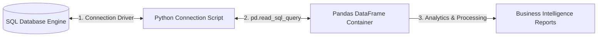

# 🗄️ Module 04: Relational Pipeline Integration (Python + SQL)

## 1. Introduction to Database Pipelines 🔄
In real-world enterprise architectures, production data is rarely stored in loose `.csv` or `.xlsx` files. Instead, it is continuously hosted inside secured **Relational Database Management Systems (RDBMS)** like MySQL, PostgreSQL, or SQLite. 

To run predictive models or performance analytics, a data professional must build a secure, dynamic pipeline that can connect Python to these storage engines, query records using Structured Query Language (SQL), and load them straight into clean computer memory.

### The Integration Workflow:
1. **Connection Engine**: Establishes a communication channel between the Python script runtime environment and the SQL database disk space.
2. **Cursor Execution**: Executes raw SQL commands (`SELECT`, `INSERT`, `UPDATE`) directly from Python.
3. **Pandas Integration**: Automates the pipeline by pulling raw query results instantly into structured DataFrames.



---

## 2. Core Industrial Features 🛠️
* **Asynchronous Data Streaming**: Pulling subsets of large multi-million row enterprise warehouses smoothly without choking server RAM.
* **ORM & Driver Adaptability**: Easily switching connection setups from internal testing models (`SQLite`) to heavy remote clouds (`MySQL/PostgreSQL`).
* **Automated Table Exporters**: Writing computed data variables and aggregates directly back into active database warehouses using single commands.
* **SQL Query Vectorization**: Offloading heavy filtering and sorting tasks directly to the database processor before loading into memory.

---

## 3. Installation & Quick Environment Verification 💻
Python comes bundled with a lightweight relational storage engine called **SQLite** in its core standard library. To connect to advanced cloud engines like MySQL, execute this installation statement inside your system terminal:

```bash
pip install mysql-connector-python sqlalchemy
```
*(Note: `SQLAlchemy` is the industry-standard database abstraction toolkit used by Pandas to optimize connection links).*

### Basic Syntax Verification:
```python
import sqlite3
import pandas as pd

# Verify base connectivity to a virtual file system memory block
connection = sqlite3.connect(":memory:")
print("Database Engine Pipeline Connection Initialization: Successful! 🎉")
connection.close()
```

---

## 🗺️ Deep-Dive Learning Sub-Modules

Click on any specialized documentation sheet below to master specific relational integration layers:

1. ### 🔌 [01: Low-Level Connectivity & Cursor Mechanics (SQLite3)](./01-Database-Connections.md)
   * Establishing database connection streams.
   * Creating operational tables and executing raw data changes (`commit()`).
   * Fetching query rows using data pointers explicitly (`fetchall()`).

2. ### 🐼 [02: High-Level Pandas Interactivity & Data Exporting](./02-Pandas-SQL-Interactions.md)
   * Transitioning query responses straight into data frames (`pd.read_sql_query`).
   * Offloading data structures directly into database servers (`df.to_sql`).
   * Optimizing indexing streams over heavy database columns.

3. ### 🧪 [03: Interactive Practice Lab Workbook](./LAB_README.md)
   * Hands-on real-world database engine pipeline challenges for students.
   * Starter code structures ready to copy-paste.

---
