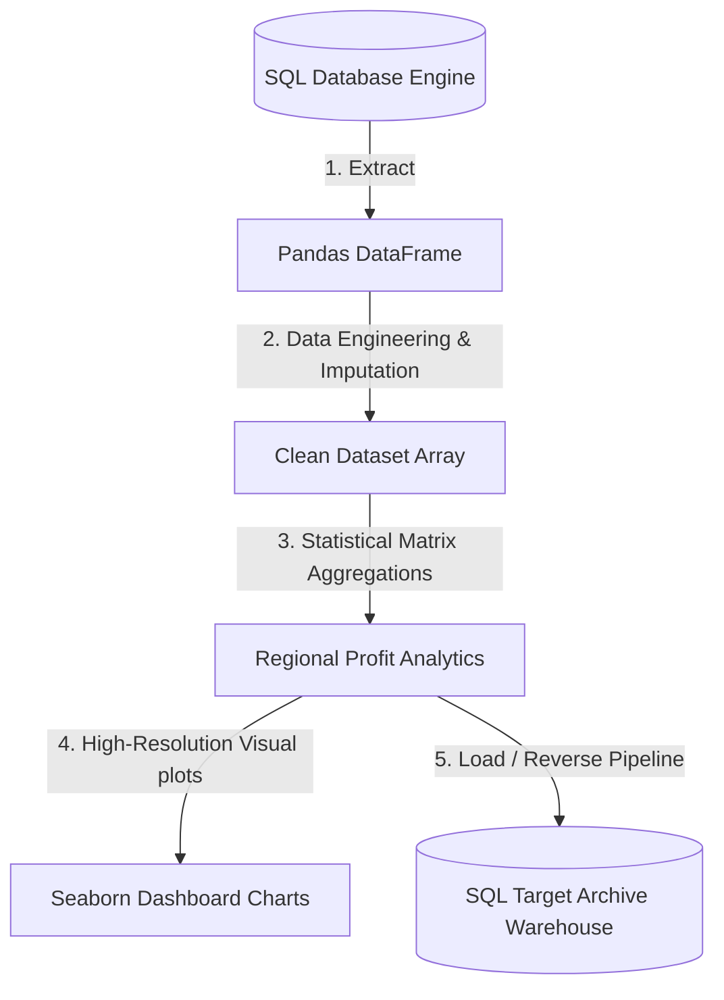

# 🚀 Module 05: Capstone Production Data Engineering Project

## 1. Project Overview & Business Case 💼
Welcome to your final Capstone Project. In the real world, data parameters do not arrive neatly sorted inside separate files. As a Data Professional, you are handed dirty relational server blocks, and you must extract, clean, engineer features, visualize metrics, and push computed analytical models back to corporate systems.

This Capstone simulates a realistic **Retail Franchise Transactional Audit**. You will build a completely automated Python script pipeline that executes these 5 critical engineering phases:

---

## 2. Structural Pipeline Execution Rules 📐

Every student must design their automation script logic inside `sales_analysis.py` fulfilling these sequential checkpoints:

### 🔹 Phase 1: Relational Data Extraction
*   Connect to the local `retail_data.db` SQLite server pipeline.
*   Query all active rows out of the transactional data tables schema.
*   Load variables instantly down into a memory-mapped Pandas DataFrame container.

### 🔹 Phase 2: Advanced Data Engineering & Mismatch Wrangling
*   **Deduplication**: Scan and isolate duplicate transactional rows and purge them immediately from the framework memory.
*   **Imputation**: Locate cells holding empty `NaN` anomalies inside the `Price_Per_Unit` column. Calculate the column scalar *Mean (Average Value)* using NumPy mechanisms and replace gaps.
*   **Feature Engineering**: Mathematically generate a brand new column named `Net_Revenue` by running vectorized multiplication across column blocks: `Units_Sold * Price_Per_Unit`.

### 🔹 Phase 3: Analytical Structural Reductions (`groupby`)
*   Group the entire dataset grid by the `Store_Region` parameter.
*   Compute total regional `Units_Sold` and global aggregate `Net_Revenue`.
*   Sort records hierarchically from highest revenue to lowest.

### 🔹 Phase 4: Graphical Visual Journalism
*   Instantiate an explicit Object-Oriented canvas plot structure (`fig, ax`).
*   Generate an attractive high-resolution **Seaborn Bar Plot** tracking `Store_Region` on X-axis vs your engineered `Net_Revenue` metric on Y-axis.
*   Format descriptive titles, enable mesh matrix grid strings, and save your dashboard chart cleanly as a file named `regional_revenue_chart.png`.

### 🔹 Phase 5: Reverse Warehouse Pipeline Ingestion
*   Stitch your sorted analytics totals matrix dictionary back into an automated DataFrame wrapper.
*   Push this calculated summary dataset straight back into the `retail_data.db` SQL engine as a permanent master backup record table named `corporate_regional_summary`.

---

## 🎯 Project Evaluation Metric Checkpoints
Your code framework will be audited against these structural grading guidelines:
1.  **Zero-Loop Compliance**: Check whether mathematical column data adjustments use vector configurations. Traditional loops will fail optimization parameters.
2.  **Null Vector Verification**: Ensure data summaries contain 0% NaN missing records.
3.  **Clean Streams Management**: Verify if active SQL server links close cleanly at script termination to avoid resource memory leakage traps.

---
