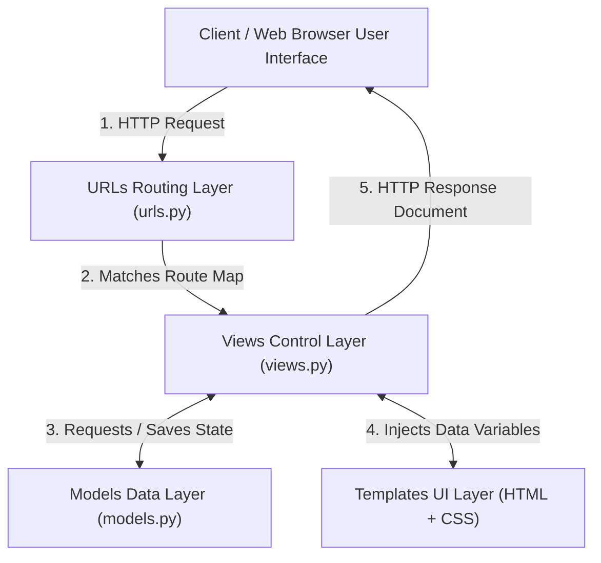

# 🧱 Module 01: Django Enterprise Architecture (MVT)

Welcome to Module 01 of Backend Engineering! Most web frameworks like Spring Boot, Laravel, or Ruby on Rails follow the traditional **MVC (Model-View-Controller)** design pattern. However, Django uses its own variation called **MVT (Model-View-Template)**. 

Understanding the request-response cycle inside this architectural model is mandatory for writing secure server code.

---

## 1. Visual Logic: The MVT Request-Response Cycle 🧠

When a client hits a specific URL layout inside a browser web interface, Django processes the network packet across these explicit core component layers:



### Core Components Defined:
*   **Model (`models.py`)**: Defines the data architecture properties (The database database layer).
*   **View (`views.py`)**: Contains the business logic code that processes incoming requests and decides what response layout to return.
*   **Template (`HTML layout`)**: The presentation layout block mixed with special Django Template Language syntax tags (`{{ variable }}`).

---

## 2. Bootstrapping a Django Project 💻

Open your local terminal shell and run these production setup instructions to boot up your absolute first server instance:

### Step A: Creating Project Directory Framework
```bash
# 1. Initialize a global project configuration block folder named 'core_backend'
django-admin startproject core_backend .

# 2. Inside the project, spin up a specific decoupled isolated app module named 'store'
python manage.py startapp store
```

### Step B: App Activation Mapping Checklist
You must explicitly announce your newly created app block inside your main configuration file pipeline (`core_backend/settings.py`):
```python
# Open core_backend/settings.py and register your application layer inside INSTALLED_APPS
INSTALLED_APPS = [
    'django.contrib.admin',
    'django.contrib.auth',
    'django.contrib.contenttypes',
    'django.contrib.sessions',
    'django.contrib.messages',
    'django.contrib.staticfiles',
    
    # Custom Workspace Registrations:
    'store.apps.StoreConfig', 
]
```

### Step C: Writing Your First Routing Architecture View
```python
# Open store/views.py and create an explicit HTTP Response payload controller
from django.http import HttpResponse

def server_home_view(request):
    return HttpResponse("<h1>Server Connection Active: Django Monolith Online! 🚀</h1>")
```

```python
# Open core_backend/urls.py and map the path routing rules
from django.contrib import admin
from django.urls import path
from store.views import server_home_view

urlpatterns = [
    path('admin/', admin.site.get_urls()),
    path('', server_home_view, name='homepage'), # Root web index path route
]
```

### Step D: Fire Up the Server Engine
```bash
# Execute structural database base synchronizations and start the development engine
python manage.py runserver
```
*Open your web browser window and browse your local endpoint: `http://127.0.0` to test live execution logs.*

---

## ⚠️ Common Pitfall: The App URL Isolation Traps
Writing all global routing URLs across separate sub-applications inside the single primary `core_backend/urls.py` index is a poor design pattern. It makes code messy as your app grows. Always isolate routing profiles inside sub-applications using `include()`:
```python
#   THE INDUSTRY ISOLATION STANDARD WAY:
# inside core_backend/urls.py
from django.urls import path, include

urlpatterns = [
    path('store/', include('store.urls')), # Points to local apps definitions safely
]
```

---
