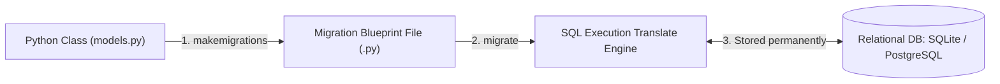

# 🗄️ Module 02: Relational Schema Mapping & Queries (Django ORM)

Welcome to Module 02! In production, software developers rarely write raw SQL text statements (`CREATE TABLE`, `SELECT *`). Doing so opens critical vulnerabilities like SQL Injection. 

Django bypasses raw database scripting using its high-speed abstraction layer called **ORM (Object-Relational Mapping)**. The ORM maps a standard Python Class straight into a physical Relational Database Table instantly.

---

## 1. Visual Logic: The ORM Database Pipeline 🧠

When you create a standard Python class template and run migration commands, Django translates your attributes into an active hard-drive database engine table setup:



---

## 2. Defining Production-Grade Database Models 🧱

Open your decoupled isolated application module (`store/models.py`) and write this enterprise database product grid template:

```python
from django.db import models

# Defining a Category Data Table
class Category(models.Model):
    title = models.CharField(max_length=100)
    created_at = models.DateTimeField(auto_now_add=True)

    def __str__(self):
        return self.title

# Defining a Product Data Table with an explicit Foreign Key (One-to-Many Relationship)
class Product(models.Model):
    # If a category is deleted, PROTECT prevents deleting products belonging to it
    category = models.ForeignKey(Category, on_delete=models.PROTECT, related_name="products")
    name = models.CharField(max_length=255)
    sku_code = models.CharField(max_length=50, unique=True)
    price = models.DecimalField(max_digits=10, decimal_places=2)
    stock_count = models.IntegerField(default=0)

    def __str__(self):
        return f"{self.name} - SKU: {self.sku_code}"
```

---

## 🛠️ The 2-Step Migration Command Engine

Whenever you create a fresh model class or modify its structural variables, you **must** run these two terminal commands sequentially to sync your hard drive disk space:

### Command 1: Creating Blueprints (`makemigrations`)
Scans `models.py` files across registered apps and generates a fresh, human-readable Python blueprint file inside the local `migrations/` sub-folder tracking your delta changes.
```bash
python manage.py makemigrations
```

### Command 2: Hard Writing to DB Disk (`migrate`)
Reads the newly generated blueprint files and translates the logic into absolute database query executions, writing real tables onto your relational database engine.
```bash
python manage.py migrate
```

---

## 💻 Querying the Database Using Python (Django QuerySets)

You don't need raw SQL query codes to fetch records. Use clean Python syntax configurations inside your `views.py` controllers or Django shell:

### A. Inserting (Creating) a New Record
```python
# First import your models explicitly
from store.models import Category, Product

# Create and save a new category instance into disk space
electronics = Category.objects.create(title="Electronics")
```

### B. Selecting / Filtering Records
```python
# 1. Fetching ALL products from the database table (Equivalent to SELECT * FROM table)
all_items = Product.objects.all()

# 2. Filtering records matching an explicit condition (SELECT * WHERE price > 500)
expensive_items = Product.objects.filter(price__gt=500.00)

# 3. Fetching a single, specific row using its unique field (Will throw error if not found)
specific_item = Product.objects.get(sku_code="SKU-9901")
```

---

## ⚠️ Common Pitfall: The Deadly N+1 Query Leak 🚨
When pulling a list of 100 products and looping through them to print their parent category titles (`product.category.title`), standard ORM code executes **1 base query** to fetch products, and then loops **100 individual queries** to hit the category database separately. This slows down production servers completely.

### The Professional Structural Fix:
Always force Django to bundle and fetch the relational row data tables upfront using a database join mechanism via `select_related()`:
```python
# 🏎️ FIXED REPAIR HIGH-SPEED SQL ENGINE EXECUTION:
# This pulls products and categories together in 1 single clean SQL JOIN statement
optimized_products = Product.objects.select_related("category").all()
```

---
