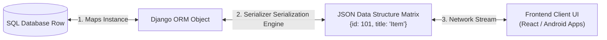

# 🔌 Module 03: Decoupled API Architectures (Django REST Framework)

Welcome to Module 03! In legacy web monolith applications, backend scripts rendered heavy HTML layouts directly. Modern enterprise tech stacks utilize **Decoupled Architecture**, meaning the Python server focuses strictly on business logic and serves data structures formatted as raw **JSON (JavaScript Object Notation)**. 

**Django REST Framework (DRF)** is the industrial framework toolkit used to build scalable, secure, and production-grade RESTful APIs.

---

## 1. Visual Logic: The Serialization Pipeline 🧠

When a mobile app or frontend React site requests data, the DRF Serialization block acts as a high-speed engine translating database relational records into standard raw JSON data lines text strings:



---

## 2. Crafting Production-Ready REST APIs 💻

To design a scalable interface pipeline over the `Product` model schema we built in Module 02, configure these files sequentially:

### Step A: Building the Data Serializer (`store/serializers.py`)
Serializers act like automated validators checking formatting strings, parsing rules, and translating data structures seamlessly:
```python
from rest_framework import serializers
from store.models import Product

class ProductSerializer(serializers.ModelSerializer):
    # Dynamic field mutation tracking configurations
    class Meta:
        model = Product
        fields = ["id", "name", "sku_code", "price", "stock_count"]
```

### Step B: Writing the High-Speed ViewSet Controller (`store/views.py`)
DRF `ModelViewSet` automatically handles all standardized REST endpoints (`GET` for fetching data lists, `POST` for saving new records, `PUT` for updates, and `DELETE` for purging records) in 3 lines of execution logic:
```python
from rest_framework.viewsets import ModelViewSet
from store.models import Product
from store.serializers import ProductSerializer

class ProductViewSet(ModelViewSet):
    queryset = Product.objects.all()
    serializer_class = ProductSerializer
```

### Step C: Setting Up the Automated REST Routing (`core_backend/urls.py`)
```python
from django.urls import path, include
from rest_framework.routers import DefaultRouter
from store.views import ProductViewSet

# DefaultRouter automatically abstracts path configurations slash patterns
router = DefaultRouter()
router.register(r'products', ProductViewSet, basename='product')

urlpatterns = [
    path('api/', include(router.urls)), # Exposes endpoints dynamically
]
```
*When your development server is running, navigate directly to **`http://127.0.0`** inside a web browser window to view the premium interactive DRF API dashboard pane.*

---

## ⚠️ Common Pitfall: The Over-Serialization Trap 🚨
When building serializers, writing `fields = '__all__'` is a lazy pattern heavily discouraged in security audits. It exposes all internal database structural properties (like internal user tracking hashes, deleted stamps, or secure validation configurations) to the global network request pool. Always declare clear-cut text strings inside the fields collection layout array explicitly!

---
