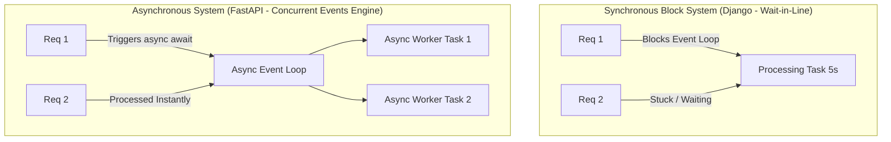

# ⚡ Module 04: Asynchronous High-Speed Microservices (FastAPI)

Welcome to Module 04! While Django is the enterprise monarch for heavy relational architectures, modern real-time microservices, streaming chats, and Artificial Intelligence (AI) model interfaces require raw processing speed. 

**FastAPI** is a frontier-class, high-performance web framework designed explicitly to handle asynchronous concurrent server worker execution using native Python type hinting parameters.

---

## 1. Visual Logic: Synchronous Blocking vs Asynchronous Non-Blocking 🧠

In traditional synchronous servers (like standard Django), if Request 1 triggers a heavy 5-second computation or database load, Request 2 must sit in line and wait. FastAPI uses an **Asynchronous Non-Blocking Event Loop** to handle multiple traffic streams concurrently:



---

## 2. Setting Up an Asynchronous Microservice 💻

Unlike Django, FastAPI doesn't build heavy structural folders automatically. You create your clean script file from scratch. Open your application layer and write a production-grade schema validation endpoint:

### Step A: Defining the Structured Request Schema (`main.py`)
FastAPI utilizes a robust framework validation layer called **Pydantic**. Pydantic strictly checks incoming JSON payloads data types before the code executes:
```python
from fastapi import FastAPI
from pydantic import BaseModel, Field

app = FastAPI(title="AI Inference API Platform")

# Defining an automatic structural validation schema data model matrix
class PredictionQuery(BaseModel):
    feature_score: float = Field(gt=0, description="Must be a positive float value")
    cluster_region: str = Field(min_length=3, max_length=50)

    class Config:
        json_schema_extra = {
            "example": {
                "feature_score": 85.50,
                "cluster_region": "North-Zone"
            }
        }
```

### Step B: Writing the Asynchronous Routing View Endpoint
```python
# Create an active asynchronous network path receiver endpoint routing rule
@app.post("/api/predict/")
async def execute_ml_inference(query: PredictionQuery):
    # Simulate high-speed non-blocking computation matrix loop allocation
    calculated_output = query.feature_score * 1.18
    
    return {
        "status": "Inference Complete",
        "processed_region": query.cluster_region,
        "prediction_result": round(calculated_output, 2)
    }
```

### Step C: Booting Up the ASGI Server Engine
FastAPI requires an external production server engine implementation called **Uvicorn** to drive async workers. Run this command inside your workspace shell environment terminal:
```bash
uvicorn main:app --reload
```
*   `main:app` tells uvicorn to look inside the `main.py` script file and connect to the instantiated `app` framework object.
*   `--reload` enables hot-reloading (server automatically updates live whenever you save changes inside code blocks).

---

## 🚀 The Killer Built-in Advantage: Automated Swagger UI Documentation
Once your Uvicorn worker engine is active, you don't need external tools like Postman to test your APIs. Open your web browser window and browse your local endpoint:

👉 **`http://127.0.0`**

FastAPI automatically parses your Pydantic schemas and creates a fully interactive, production-quality **Swagger UI Dashboard**. You can test endpoints, read descriptions, and cross-examine validation models natively in real-time.

---
