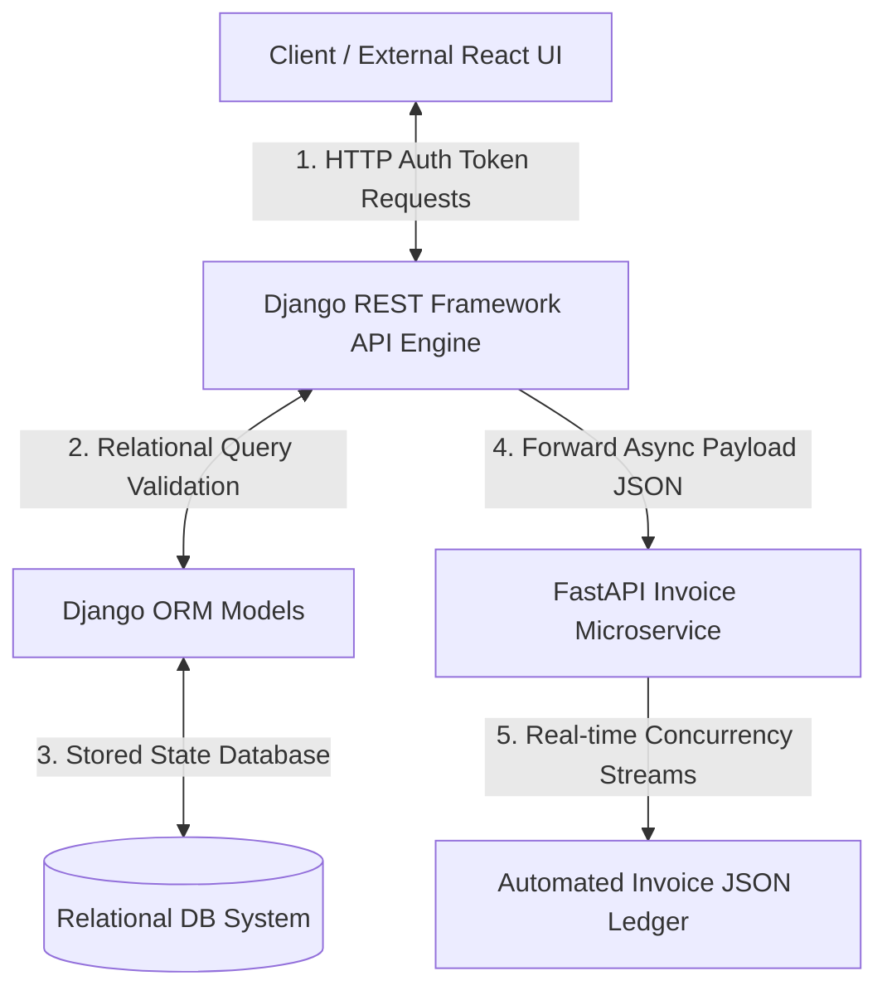

# 🚀 Module 05: Capstone Multi-User E-Commerce Production Platform

## 1. Project Overview & Monolith-Microservice Hybrid Architecture 💼
Welcome to your final Web Engineering Capstone Project. In modern tech systems, single open architectures are rarely used. Enterprise software uses a hybrid setup: a secure **Django monolith database engine** handles heavy customer profiles, transactional orders, and secure data states, while an external asynchronous **FastAPI service nodes container** executes fast real-time invoice generation streams or analytics calculations concurrently.

You will build a completely automated, production-grade decoupled hybrid server cluster that implements the following 5 engineering phases:

---

## 2. Structural Cluster Execution Rules 📐

Every student must design their application logic across their codebase fulfilling these sequential checkpoints:

### 🔹 Phase 1: Relational Schema Foundations (Django Core)
*   Create a specialized class model named `InventoryItem` with attributes: `title`, `sku_string` (unique identifier), and `unit_price`.
*   Establish a secondary class model named `CustomerTransaction` linking a `ForeignKey` directly back to the item. Protect deletion parameters completely (`on_delete=models.PROTECT`).

### 🔹 Phase 2: Decoupled Serializers & REST Views (DRF Pipeline)
*   Construct a secure `ModelSerializer` container block explicitly mapping order features into clean binary JSON arrays. Avoid using unmapped variables.
*   Expose this pipeline over a dynamic `ModelViewSet` routing infrastructure accessible under the global client route pattern `api/checkout/`.

### 🔹 Phase 3: Token-Based Route Security Guard
*   Configure Django's integrated security token handlers.
*   Force your checkout view endpoints to block raw global traffic. Only client requests containing a verified authorization header token (`Authorization: Token <key>`) must be allowed entry parameters.

### 🔹 Phase 4: Async Dispatch Invoice Microservice (FastAPI Layer)
*   Inside your `main.py` microservice pipeline workspace, build an asynchronous receiver path endpoint route named `@app.post("/microservice/invoice/")`.
*   Utilize Pydantic data modeling validations to cross-examine incoming raw transactional parameters arriving from the Django checkout view.

### 🔹 Phase 5: Production Verification Testing Checkpoints
*   Boot up both server worker units concurrently inside separate terminal terminals (`python manage.py runserver` on Port 8000 and `uvicorn main:app` on Port 8010).
*   Execute a cross-server pipeline call where Django takes a user checkout order, securely writes it to the database using the ORM layout, and instantly dispatches a background task payload to the FastAPI microservice loop to generate a real-time transactional summary.

---

## 🎯 Project Evaluation Metric Checkpoints
Your system codebase will be audited against these critical grading criteria:
1.  **N+1 Query Compliance**: Check whether your transaction endpoint query lists integrate `select_related()` optimization guards.
2.  **Pydantic Schema Robustness**: Ensure incoming FastAPI JSON keys explicitly crash with standard 422 errors if dirty values are sent.
3.  **Token Authorization Lockout**: Verify that unauthorized client API calls are instantly denied entry with 403 Forbidden status logs.
---
