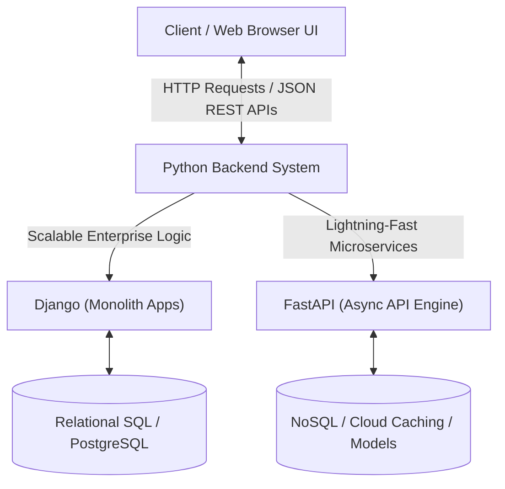

# 🌐 Track B: Full-Stack Web Development & Backend Engineering

## 1. Introduction to Python Web Architectures 🚀
In the modern tech market, backend engineering requires stability, top-tier database management, secure user controls, and high-performance server processing speed. Python handles this elegantly across two different scales:

1. **Django**: The undisputed king of enterprise apps. It follows a "Batteries-Included" philosophy, meaning it comes integrated with its own database manager, administration panel, form validators, and security guards out-of-the-box.
2. **FastAPI**: The modern, asynchronous microservice infrastructure designed for high-concurrency requests, cloud applications, and integrating Artificial Intelligence (AI) model prediction endpoints.



---

## 2. Core Market Placement & Job Profiles 💼
Full-stack and backend competencies are continuously highly ranked profiles across job placements:
1. **Backend Developer (Django/FastAPI)** (Average Salary: ₹5.5 LPA - ₹9 LPA)
2. **Full-Stack Software Engineer** (When combined with React/HTML/Tailwind) (Average Salary: ₹6.5 LPA - ₹12 LPA)
3. **API Engineer / Integration Consultant** (Average Salary: ₹6 LPA - ₹10 LPA)

---

## 🗺️ Specialized Learning Roadmap

Click on any specific module sub-folder to explore comprehensive theory, architecture logs, and practical lab handbooks:

### 1. [Module 01: Django Enterprise Architecture (MVT)](./01-Django-Architecture-MVT/README.md) 🧱
* Mastering Model-View-Template compilation flow charts.
* Processing user inputs safely using forms and session managers.
* Setting up automated multi-user administrative dashboards natively.

### 2. [Module 02: Relational Schema Mapping & Queries (Django ORM)](./02-Django-ORM-Databases/README.md) 🗄️
* Abstracting relational queries without writing standard raw SQL statements.
* Data Migrations engine, schema mutations, validations, and row deletions.
* Model Relationships configuration (One-to-One, One-to-Many, Many-to-Many connections).

### 3. [Module 03: Decoupled API Architectures (Django REST Framework)](./03-Django-REST-Framework-APIs/README.md) 🔌
* Building production RESTful API endpoints for external React/Mobile integrations.
* Serialization blocks (Converting internal database tables into clean JSON matrices).
* Token-based authorizations, authentication protocols, and route security.

### 4. [Module 04: Asynchronous High-Speed Microservices (FastAPI)](./04-FastAPI-Microservices/README.md) ⚡
* Understanding Asynchronous server workers (`async/await` mechanics).
* Data structural validation layers using native Pydantic wrappers.
* Automated documentation mapping features via embedded Swagger UI setups.

### 5. [Module 05: Capstone Multi-User E-Commerce Production Platform](./05-Capstone-Web-Project/README.md) 🏆
* End-to-end multi-tenant project dashboard architecture building.

---

## 💻 Technical Stack Installation Command
To bootstrap a professional local workspace for web engineering, students must execute the following installer string in their environment terminals:
```bash
pip install django djangorestframework fastapi uvicorn pydantic
```
*(Note: `uvicorn` acts as the asynchronous ASGI web server deployment engine for running FastAPI).*

---
