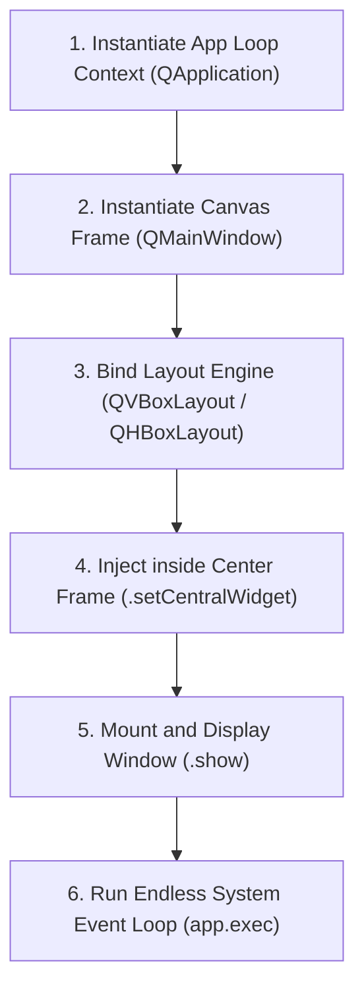

# 🧱 Module 01: PySide6 Windows, Core Widgets & Box Layouts

Welcome to Module 01 of GUI Engineering! Unlike web servers that sit and listen for background requests, a desktop graphical application is an **Event-Driven Lifecycle Application**. It hooks straight into your system operating OS windowing manager and loops endlessly until explicit exit commands are passed.

---

## 1. Visual Logic: The Desktop App Initialization Lifecycle 🧠

Every PySide6 software interface requires an active Application loop runtime context wrapping an active Main Window canvas frame layer:



---

## 2. Bootstrapping a Desktop Application 💻

Open your local script editor workspace and implement this clean object-oriented production structure to boot up your absolute first native system window:

### Production Code Blueprint Template:
```python
import sys
# Importing strict PySide6 standard modules layout
from PySide6.QtWidgets import QApplication, QMainWindow, QWidget, QLabel, QPushButton, QVBoxLayout

class MainWindow(QMainWindow):
    def __init__(self):
        super().__init__()
        
        # 1. Setting up window title and boundary metrics window
        self.setWindowTitle("Enterprise Dashboard Manager v1.0")
        self.resize(400, 300) # Width=400 pixels, Height=300 pixels
        
        # 2. Instantiating Foundational User Input Widgets
        self.text_label = QLabel("Welcome to PySide6 Desktop Systems Engineering!")
        self.action_button = QPushButton("Synchronize System")
        
        # 3. Arranging items vertically using a Box Layout Engine
        layout_engine = QVBoxLayout()
        layout_engine.addWidget(self.text_label)
        layout_engine.addWidget(self.action_button)
        
        # 4. CRITICAL CHECKPOINT: Building the Central Widget Shell
        # QMainWindow cannot hold layouts directly. We must bind layouts to a 
        # blank master widget shell and set it as the Central Window Widget.
        central_widget_shell = QWidget()
        central_widget_shell.setLayout(layout_engine)
        self.setCentralWidget(central_widget_shell)

if __name__ == "__main__":
    # 5. Boot up the operating system interaction channel context
    app_context = QApplication(sys.argv)
    
    # 6. Instantiate and mount your structural window
    main_window_instance = MainWindow()
    main_window_instance.show()
    
    # 7. Start the endless event execution processing loop safely
    sys.exit(app_context.exec())
```

---

## 3. Structural Layout Grid Mechanics
To design reactive interfaces that adjust proportions automatically when a user resizes the window, you must utilize layout managers instead of absolute positioning coordinates:
*   **`QVBoxLayout`**: Arranges children sequentially in a top-to-bottom vertical line stack.
*   **`QHBoxLayout`**: Arranges children sequentially in a left-to-right horizontal line stack.
*   **`QGridLayout`**: Arranges items over a custom row/column mathematical mapping structure (`row, column`).

---

## ⚠️ Common Pitfall: The Frozen Window Execution Loop Traps
Running a custom `while True:` continuous monitoring routine or an infinity counter directly inside the same file view method sequence will immediately lock the `QApplication.exec()` event engine loop. This triggers the operating system to show the dreaded **"Application is Not Responding (Not Responding)"** system crash screen. Never execute heavy continuous calculations on the main execution thread line!

---
