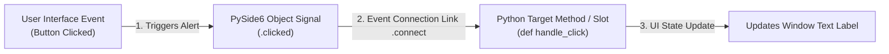

# 🗛 Module 02: Event-Driven Systems & Interactivity (Signals & Slots)

Welcome to Module 02! In standard console scripts, code executes sequentially from top to bottom. In a desktop GUI app, code waits for the user to do something (like clicking a button, hovering a mouse, or typing text). 

This communication framework between user actions and backend Python logic is powered by PySide6's high-speed **Signals & Slots** engine.

---

## 1. Visual Logic: The Signals & Slots Architecture 🧠

Think of a **Signal** as an automated alert notification 🔔 that gets broadcasted when an event occurs. Think of a **Slot** as a custom Python function script execution block ⚙️ that catches that alert and processes it:



---

## 2. Implementing Interactivity Natively 💻

Open your local script workspace and try this production-grade interactive software template. It demonstrates how clicking an interface button dynamically reads data from input fields and alters the state of text screens:

### Production Code Blueprint Template:
```python
import sys
# Importing strict PySide6 standards
from PySide6.QtWidgets import QApplication, QMainWindow, QWidget, QLabel, QLineEdit, QPushButton, QVBoxLayout

class InteractiveApp(QMainWindow):
    def __init__(self):
        super().__init__()
        self.setWindowTitle("Secure Data Vault v1.2")
        self.resize(350, 200)
        
        # 1. Instantiating View Elements
        self.header_label = QLabel("Enter Secret Validation String:")
        self.input_field = QLineEdit()
        self.trigger_btn = QPushButton("Submit Activation Code")
        
        # 2. Structural Layout Configuration Block
        layout = QVBoxLayout()
        layout.addWidget(self.header_label)
        layout.addWidget(self.input_field)
        layout.addWidget(self.trigger_btn)
        
        central_shell = QWidget()
        central_shell.setLayout(layout)
        self.setCentralWidget(central_shell)
        
        # 3. CRITICAL INTERACTIVITY STEP: Connecting Signal to Slot
        # .clicked is the native PySide6 Signal object for QPushButton.
        # We attach it to our custom execution method 'self.on_submit_clicked' using .connect().
        self.trigger_btn.clicked.connect(self.on_submit_clicked)

    # 4. Defining the Target Slot Function
    def on_submit_clicked(self):
        # Extract user typed text string dynamically from input line box
        user_input_text = self.input_field.text().strip()
        
        if user_input_text == "ADMIN123":
            self.header_label.setText("Access Status: APPROVED! 🔓")
            self.header_label.setStyleSheet("color: green; font-weight: bold;")
        else:
            self.header_label.setText("Access Status: REJECTED! ⛔")
            self.header_label.setStyleSheet("color: red; font-weight: bold;")

if __name__ == "__main__":
    app = QApplication(sys.argv)
    window = InteractiveApp()
    window.show()
    sys.exit(app.exec())
```

---

## 3. Core Structural Principles of Signals & Slots
*   **Decoupled State Architecture**: Signals don't know or care what slot function is listening to them. You can attach multiple distinct function slots to a single button click!
*   **Automatic Argument Extraction**: Advanced signals (like a dropdown menu selection change `currentIndexChanged`) pass the newly selected row integer directly into your target slot method parameter list automatically.

---

## ⚠️ Common Pitfall: The Parenthesis Connection Trap 🚨
When binding a signal to a slot method block using `.connect()`, **never put parenthesis `()` after the function name**. Doing so calls the function immediately during application startup initialization instead of waiting for a button click!
```python
# ❌ INCORRECT (Will trigger execution immediately on boot up)
# self.trigger_btn.clicked.connect(self.on_submit_clicked())

#   CORRECT PRODUCTION STANDARD (Passes function reference safely)
self.trigger_btn.clicked.connect(self.on_submit_clicked)
```
---
