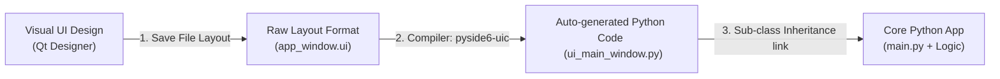

# 📐 Module 03: Rapid Prototyping Tools & Serialization (Qt Designer)

Welcome to Module 03! When constructing large enterprise applications with dozens of screens, complex grids, and input panels, writing hundreds of layout rows manually in pure Python code becomes highly inefficient. 

Professional GUI engineering teams follow a **Decoupled Workflow**: they visually prototype layouts inside a drag-and-drop tool called **Qt Designer**, save the output as an XML schema file, and compile it seamlessly into clean Python script components.

---

## 1. Visual Logic: The Qt Designer Serialization Pipeline 🧠

The architectural lifecycle of a modern desktop application framework moves through these clear compilation phases:



---

## 2. Launching and Using the Visual Layout Engine 💻

### Step A: Finding and Launching Qt Designer
Qt Designer is pre-packed inside your system environment automatically when you install PySide6. To launch the visual canvas terminal window, execute this statement inside your terminal:
```bash
pyside6-designer
```
*(A premium desktop drag-and-drop workspace window will open instantly on your screen, allowing you to drop Inputs Buttons, Layout Boxes, and Tables seamlessly).*

### Step B: The Serialized Code Compilation Command (`pyside6-uic`)
When you finish arranging your custom grids in Qt Designer, click **Save As** and store it as a file named `main_window.ui` (User Interface file format). 

To convert this abstract schema file into a pure Python script container that can be safely imported into your backend workspace, execute this compiler terminal pipeline query:
```bash
pyside6-uic main_window.ui -o ui_main_window.py
```
*   `main_window.ui`: Your raw saved XML visual layout template model file input.
*   `-o ui_main_window.py`: The newly compiled and ready structural code output script file target.

---

## 3. Connecting Frontend Design Sheets onto Python Backend Controllers

**Never write your custom Signals, Slots, or API Logic inside the auto-generated code file (`ui_main_window.py`)!** 

If you make modifications inside Qt Designer later and recompile, your manual backend code will be completely wiped out. Always load your design components safely using the clean **Multiple Inheritance Multi-Class Pattern**:

### Production Architecture Implementation Layout:
```python
import sys
from PySide6.QtWidgets import QApplication, QMainWindow
# Import the auto-generated UI blueprint class layout explicitly
from ui_main_window import Ui_MainWindow

class LogicControllerWindow(QMainWindow, Ui_MainWindow):
    def __init__(self):
        super().__init__()
        
        # 1. Mount the auto-compiled visual components framework onto the window canvas
        self.setupUi(self)
        
        # 2. Wire your interactive elements safely using your designer object names
        # Assuming you dragged a button named 'login_btn' inside Qt Designer:
        self.login_btn.clicked.connect(self.process_secure_login)

    def process_secure_login(self):
        # Assuming you dragged an input field named 'username_input' inside Qt Designer:
        user_text = self.username_input.text().strip()
        print(f"[BACKEND LOGIC]: Processing system authorization request for user: {user_text}")

if __name__ == "__main__":
    app = QApplication(sys.argv)
    window = LogicControllerWindow()
    window.show()
    sys.exit(app.exec())
```

---

## ⚠️ Common Pitfall: Editing Compiled UI Code directly 🚨
Altering or typing manual operations straight within the lines of `ui_main_window.py` is a major architectural anti-pattern in desktop software systems. Treat the compiled file strictly as an immutable asset pipeline. Always keep your backend logic completely isolated inside your controller files.

---
