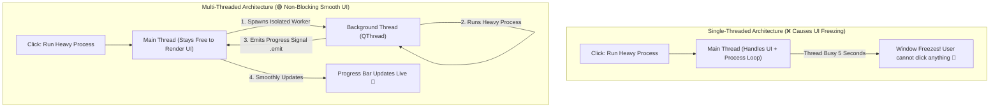

# ⚡ Module 04: Non-Blocking UIs & Concurrent Workers (QThread)

Welcome to Module 04! One of the most common issues in desktop app development is a **Frozen User Interface**. When a user clicks a button that starts a heavy operation (like downloading a 500MB file, executing a huge dataset loop, or connecting to a remote database), the screen completely locks up, clicks stop working, and the operating system flags the app as **"Not Responding"**.

To keep desktop windows responsive, we must offload heavy workloads to a background layer using PySide6's dedicated multi-threading framework: **`QThread`**.

---

## 1. Visual Logic: Main Thread vs Background Worker Threads 🧠

The Main Thread (GUI Thread) must handle *only* drawing layout elements, tracking cursor frames, and rendering clicks. Heavy database processing loops must be offloaded to an isolated background thread channel:



---

## 2. Implementing Background Workers Using `QThread` 💻

Open your local script workspace and test this production-grade asynchronous multi-threading design architecture pattern. It demonstrates how to spin up a background task pipeline and broadcast metrics values safely back to the UI interface thread:

### Production Code Architecture Blueprint:
```python
import sys
import time
# Importing strict PySide6 core threading components layout
from PySide6.QtCore import QThread, Signal
from PySide6.QtWidgets import QApplication, QMainWindow, QWidget, QPushButton, QLabel, QProgressBar, QVBoxLayout

# STEP A: Create an independent Worker class inheriting from QThread
class HeavyDataCalculationWorker(QThread):
    # Establish a custom tracking Signal to emit updates across threads safely
    progress_signal = Signal(int)
    completion_signal = Signal(str)

    def run(self):
        """The core heavy loop logic goes exclusively inside the run method."""
        for step in range(1, 101):
            time.sleep(0.05) # Simulating heavy database processing or model loops
            self.progress_signal.emit(step) # Broadcast completion percentage dynamically
            
        self.completion_signal.emit("Data Synchronized Successfully! 🎉")

# STEP B: Build your main window to control the worker thread channel
class DashboardWindow(QMainWindow):
    def __init__(self):
        super().__init__()
        self.setWindowTitle("Async Performance Core")
        self.resize(350, 180)

        # UI Widgets Layout
        self.status_label = QLabel("System Idle...")
        self.progress_bar = QProgressBar()
        self.start_btn = QPushButton("Trigger Heavy Analytics Sync")

        layout = QVBoxLayout()
        layout.addWidget(self.status_label)
        layout.addWidget(self.progress_bar)
        layout.addWidget(self.start_btn)

        central_shell = QWidget()
        central_shell.setLayout(layout)
        self.setCentralWidget(central_shell)

        # Connect button to start the multi-threading worker pipeline
        self.start_btn.clicked.connect(self.launch_background_worker)

    def launch_background_worker(self):
        self.status_label.setText("Processing Network Sync Streams...")
        self.start_btn.setEnabled(False) # Disable button to prevent double triggering spikes

        # 1. Instantiate the worker thread block
        self.worker = HeavyDataCalculationWorker()

        # 2. CRITICAL LINK: Connect thread Signals safely to UI modifier Slots methods
        self.worker.progress_signal.connect(self.progress_bar.setValue)
        self.worker.completion_signal.connect(self.on_process_complete)

        # 3. Fire up the background execution thread loop channel
        self.worker.start()

    def on_process_complete(self, outcome_message):
        self.status_label.setText(outcome_message)
        self.start_btn.setEnabled(True) # Re-enable the interface controls safely

if __name__ == "__main__":
    app = QApplication(sys.argv)
    window = DashboardWindow()
    window.show()
    sys.exit(app.exec())
```

---

## ⚠️ Common Pitfall: Modifying UI Elements directly from a QThread 🚨
Never type interface-modifying commands (like `self.label.setText()`) inside the `run()` execution block of a background `QThread`. Desktop GUI architectures restrict UI modifications strictly to the Main Thread. Violating this rule will cause immediate, random segment crashes or completely break system memory. **Always communicate data back using `Signal.emit()` strings.**

---
