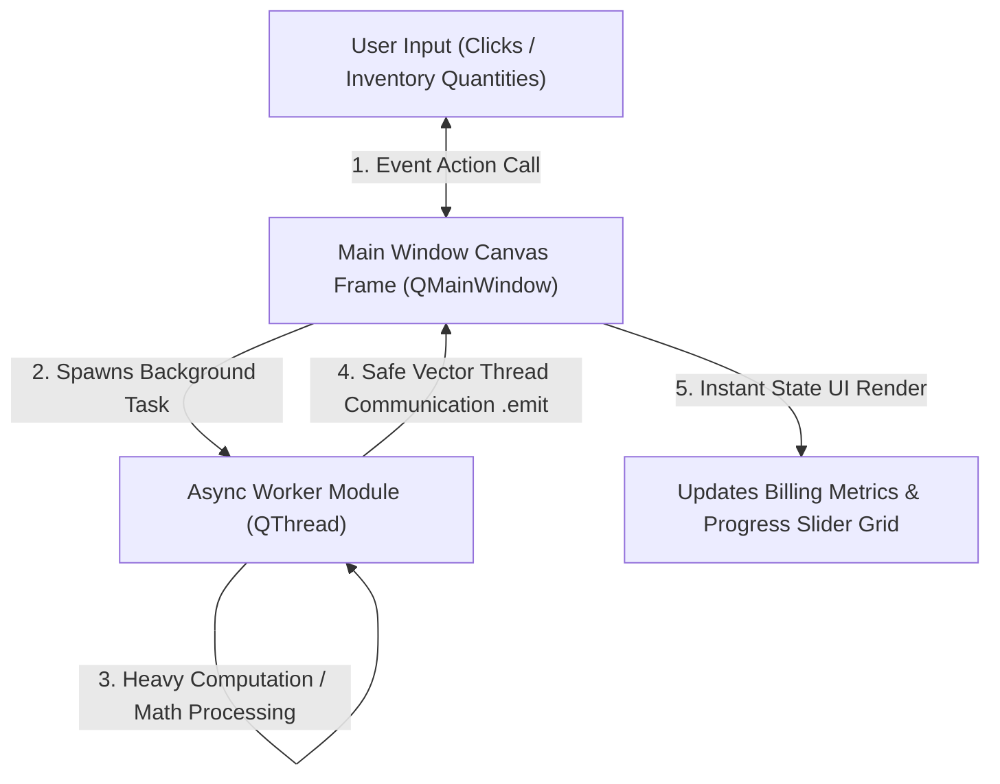

# 🚀 Module 05: Capstone Standalone Billing & Inventory Management Software

## 1. Project Overview & Multi-Threaded Desktop Architecture 💼
Welcome to your final GUI Systems Engineering Capstone Project. In commercial desktop deployments (like retail POS machines, warehouse inventory monitors, or billing desks), software systems must handle data streams natively without network lags. The application window interface must stay completely responsive to click frames while heavy data computations or permanent file storage operations execute simultaneously.

You will build a professional, standalone **Billing Counter Application** using a clean decoupled thread module design layout context:

---

## 2. Structural Application Execution Rules 📐

Every student must build their system control layout patterns inside an application script workspace fulfilling these sequential checkpoints:

### 🔹 Phase 1: High-Fidelity Responsive Interface Layout
*   Construct an active application window frame inheriting strictly from `QMainWindow`.
*   Arrange components systematically utilizing mixed layout managers: Use a horizontal box (`QHBoxLayout`) to hold tabular quantity input fields, and stack them vertically (`QVBoxLayout`) above action buttons to guarantee seamless display resizing.

### 🔹 Phase 2: Interactivity Event Binding (Signals & Slots)
*   Bind the primary verification button click signal (`.clicked`) directly to an internal custom processing view method slot.
*   Ensure input numerical lines safely filter out loose spacing strings using native text parsing hooks (`.text().strip()`).

### 🔹 Phase 3: Non-Blocking Processing Engine (`QThread`)
*   Create an independent background worker layer running over a decoupled `QThread` sub-class.
*   Offload the heavy arithmetic tasks (like compiling financial discount percentages, scanning transaction logs, or appending inventories lists onto local disk arrays) exclusively into the worker's `.run()` environment loop.

### 🔹 Phase 4: Thread-Safe State Communications
*   Instantiate custom `Signal(int)` and `Signal(str)` communication objects to pass status messages safely between the active thread spaces.
*   Connect the background tracking markers right onto real-time user indicator progress widgets (`QProgressBar`) inside the main layout view.

### 🔹 Phase 5: Hardware-Ready Verification Checks
*   Launch your software platform. Trigger a continuous 100-step corporate accounting simulation audit loop via your threading controls.
*   While the background thread task progress bar handles calculation jumps step-by-step, manually click input fields and type items to verify that the canvas window stays 100% fluid, non-blocking, and free from system hang flags.

---

## 🎯 Project Evaluation Metric Checkpoints
Your desktop system architecture codebase will be audited against these critical grading guidelines:
1.  **Thread Isolation Compliance**: Check whether any interface data modification call (like `.setText()`) is written within background threads lines. Doing so will immediately fail code review parameters.
2.  **Parenthesis Reference Accuracy**: Verify that signals connection binding conduits pass function references cleanly without immediate execution brackets `()`.
3.  **Active Memory Safety**: Ensure the application loop environment context wraps up and releases hardware pointers cleanly upon closing the desktop window layout frame.
---
