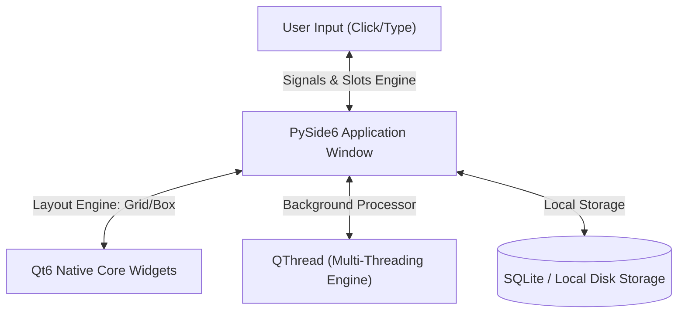

# 💻 Track C: Desktop Application Development & GUI Engineering

## 1. Introduction to PySide6 & Qt6 Architecture 🚀
While web apps run inside a browser sandboxed framework, enterprise systems (like medical monitors, billing desks, video editors, and engineering software) require high-performance, native **Desktop Graphical User Interfaces (GUIs)** that communicate directly with the local Operating System and hard drive.

**PySide6** is the official Python binding for the industry-standard **Qt6 framework** (built by The Qt Company). It allows developers to build smooth, hardware-accelerated, cross-platform applications that look identical across Windows, macOS, and Linux systems.



---

## 2. Core Market Placement & Job Profiles 💼
GUI developers with strong framework concepts are highly demanded across engineering, hardware industries, and film studios:
1. **GUI Software Engineer (Python/Qt)** (Average Salary: ₹5 LPA - ₹9 LPA)
2. **Internal Tools Developer** (Game studios & VFX companies like Autodesk plugins) (Average Salary: ₹6 LPA - ₹11 LPA)
3. **Application Architect** (Desktop Automation systems) (Average Salary: ₹7 LPA - ₹12 LPA)

---

## 🗺️ Specialized Learning Roadmap

Click on any specific module sub-folder to explore comprehensive theory, architecture logs, and practical lab handbooks:

### 1. [Module 01: Qt6 Windows, Core Widgets & Box Layouts](./01-Qt6-Widgets-Layouts/README.md) 🧱
* Mastering `QMainWindow`, layouts application windows, and lifecycle steps.
* Arranging user view elements systematically using `QVBoxLayout`, `QHBoxLayout`, and `QGridLayout`.
* Extracting text inputs dynamically using inputs widgets (`QLineEdit`, `QPushButton`, `QLabel`).

### 2. [Module 02: Event-Driven Systems & Interactivity (Signals & Slots)](./02-Signals-Slots-Interactivity/README.md) 🎛️
* Understanding Qt's native event communication protocol: **Signals & Slots**.
* Binding button clicks to custom Python execution functions.
* Transferring computational variables safely across custom desktop triggers.

### 3. [Module 03: Rapid Prototyping Tools & Serialization (Qt Designer)](./03-Qt-Designer-UI-Conversion/README.md) 📐
* Using the visual drag-and-drop tool **Qt Designer** to construct fluid software grids.
* Converting `.ui` visual design layouts into pure executable Python script code wrappers.
* Separating frontend visual looks from behind backend logical programming slots.

### 4. [Module 04: Non-Blocking UIs & Concurrent Workers (QThread)](./04-Multi-Threading-QThread/README.md) ⚡
* The critical issue of Frozen Windows: Why heavy computations crash standard desktop loops.
* Isolating processing threads cleanly from the main view canvas utilizing **`QThread`**.
* Broadcasting worker progress signals straight back to progress indicator bars dynamically.

### 5. [Module 05: Capstone Standalone Billing & Inventory Management Software](./05-Capstone-Desktop-Project/README.md) 🏆
* Designing an end-to-end hardware-ready business manager application tool.

---

## 💻 Technical Stack Installation Command
To bootstrap a professional local workspace for desktop systems engineering, students must execute the following installer string in their system terminals:
```bash
pip install PySide6
```
*(Note: Installing PySide6 automatically packs the full Qt Designer graphical UI builder bundle inside your python directory tools).*

---
